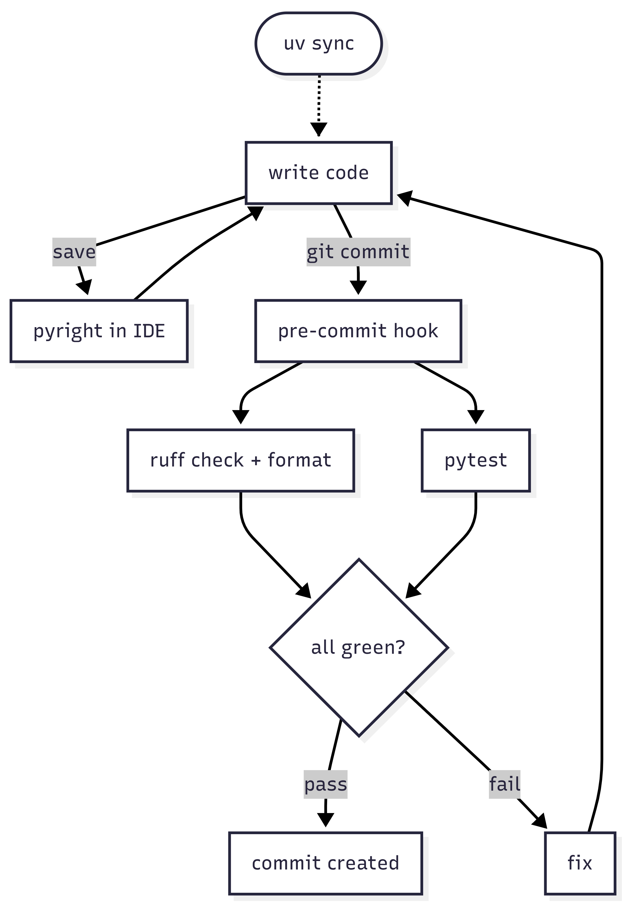

## A repo to refresh, several rabbit holes to dive into

A while ago, at PyCon IT, I attended a talk that opened my eyes on [pytest](https://pypi.org/project/pytest/):

- simpler test management, especially for mocks
- parametrizable fixtures instead of the `setUp` / `tearDown` ritual
- bare `assert` instead of a thousand `self.assertEqual`

I'd like my repo [python-prototype](https://github.com/bilardi/python-prototype/), born for educational purposes, to also be a bit of a template I can pull off the shelf for the next projects.

So, with the excuse of refreshing the testing system with pytest and the packaging with [pyproject](https://packaging.python.org/en/latest/guides/writing-pyproject-toml/), I started thinking about adding more.

I had been using [black](https://pypi.org/project/black/) and [pylint](https://pypi.org/project/pylint/) for a long time, so my first thought was: ok, let's bring in formatting and linting too. But I asked myself: isn't there something better that maintains style ([PEP 8](https://peps.python.org/pep-0008/)), docstrings ([PEP 257](https://peps.python.org/pep-0257/)) and type hints ([PEP 484](https://peps.python.org/pep-0484/)) automatically ?

And the environment, can it be modernized too ? With what ? Well, just like there are two schools, emacs and vi, there are also two schools, [poetry](https://python-poetry.org/) and [uv](https://docs.astral.sh/uv/) .. without even mentioning all the others.

What I needed was something to cover code quality, formatting, packaging and beyond: fewer tasks left to memory or to reading the holy README, more chances they actually get done.

Since there's no "all-inclusive package", the plan was to test what was maintained and maintainable, and find the one most suited to my needs.

## Today's chosen stack

Four tools, not ten:

- **uv**: the env manager. Replaces `pip` and `venv`. One Rust binary.
- **[ruff](https://docs.astral.sh/ruff/)**: formatting and linting. Replaces `black`, `isort`, `flake8` and most of `pylint`. Another Rust binary.
- **[pyright](https://microsoft.github.io/pyright/)**: the type checker. Skipping [mypy](https://mypy-lang.org/), [pyrefly](https://pyrefly.org/) and [ty](https://github.com/astral-sh/ty). For now.
- **[pre-commit](https://pre-commit.com/)**: a git-hook that runs ruff and pytest automatically before every commit. Just .. remember to set it up at the start of the project !

The single criterion that drove all these choices is **least total effort**. Fewer tools = less config = less maintenance. The lazy developer wants the toolchain to break before the commit, in case some step gets forgotten. But without overdoing it: just enough to produce quality code.

## Stories from the field

### Pylint and the 4.35/10 grade

The first run of pylint on simple-sample stings: 4.35/10. A high school grade, not a teaching repo's. I sit down to fix my JavaScript hangover: `myClass` becomes `my_class` (PEP 8 naming), `foo` and `bar` and `foobar` become `get_param_processing`, `get_boolean`, `get_reverse_protected_param` (names that say what they do). Up to 9.41/10.

But before claiming victory, three warnings need a decision:

- **W0223**: abstract method not implemented in a subclass. Pylint flags it as a bug to fix. In my case it MUST fail: it's part of the educational example. I keep it.
- **C0301**: line too long. I look: it's an HTTP link in a docstring, can't be broken. I ignore it.
- **C0104**: names like "foo" and "bar" are disallowed. I could disable the rule globally, but here I prefer having spent the hour of restructuring: variables and methods should be expressive.

Each of these decisions is a "the tool is right about the code but not about the context". And here is where pylint's limit shows up: it tells you what it found, not whether it really needs fixing. The case-by-case judgement stays with you: it doesn't change anything by itself.

### Pylint doesn't understand pytest

I go looking for trouble, and run pylint on the test suite: a new warning shows up, W0621 `redefining-outer-name`, on the fixtures:

```python
@pytest.fixture
def mci():
    return MyClassInterface()

def test_mci_creation(mci):
    assert isinstance(mci, MyClassInterface)
```

Pylint says "you're redefining `mci` from the outer scope". But this pattern is the way fixtures work: it's not redefinition, it's parameter injection. Pylint reads the code as if it were running it, but it doesn't know how pytest runs it.

False positive. The workaround exists:

```python
@pytest.fixture(name="mci")
def mci_fixture():
    return MyClassInterface()

def test_mci_creation(mci):
    assert isinstance(mci, MyClassInterface)
```

But it's there to silence pylint, not to improve the code. I don't add it. And here I start thinking that pylint is old for pytest, and it's time to switch tool.

### Ruff arrives and takes black's place

I try `ruff check` and `ruff format`. It covers practically everything black did for formatting, and a good chunk of what pylint did for linting. One binary. Config in `pyproject.toml`: a single section instead of two. Execution time: milliseconds.

Ruff openly states the trade-off: it's AST-based and works on a single file at a time, it doesn't "read" the class hierarchy across files. So the abstract method not overridden, which I do need to see, doesn't get flagged. Ruff is a fast surface linter, not a deep analyst.

Ok. Ruff takes black's place and covers most of pylint. For what's missing (abstract method, type consistency across files) I need another tool: a type checker.

### The type checker tour

Pylint flagged both typing and scoping errors (W0621 is a style check, not a type one). Choosing a type checker, I focus on the typing front: the scoping front stays out of this tour.

I add type hints everywhere, otherwise the type checkers would throw a sea of red (with nothing to check): the signature `def get_param_processing(self, param):` becomes `def get_param_processing(self, param: bool) -> bool:`.

Then I run mypy, pyrefly, ty, pyright on the same code to see who flags what.

| Tool | Abstract method not implemented | Return None where type hint says bool | Other |
|------|---------------------------------|--------------------------------------|-------|
| mypy | yes | yes | historical, slow |
| pyrefly | in a different form | yes | lightning fast, young |
| ty | yes (interface only) | yes | lightning fast, young |
| pyright | yes | yes | also flags a third error: the method is used in MyClass |

Pyright finds more and has a mature ecosystem: Microsoft maintains it actively, and Pylance (the Python extension for VS Code) is built on top of pyright. Pyright wins. Pyrefly and ty are under active development: I'll come back to them later.

### The workflow breaking at the first `make patch`

Setup done. Ruff passes clean. Pyright passes clean. Pre-commit stops me if I forget something. I run `make patch` for the first "real" release .. and:

```
make[1]: bump-my-version: No such file or directory
```

The Makefile was calling `bump-my-version` directly, and the project's dev-deps were in `tests/requirements-test.txt`, not in `pyproject.toml`. So whoever cloned the repo had to know to do a `pip install -r tests/requirements-test.txt` on top of `uv sync`, and the release workflow assumed the venv was activated. Too much implicit knowledge, too much hassle.

I'm so used to using `uv run` that I don't run `source .venv/bin/activate` anymore, so I tripped over something that "the old-fashioned way" would never have happened.

What did it take to truly hand the environment over to uv ? Well, all I needed was to add every dependency in `pyproject.toml` with:

```bash
uv add --dev -r tests/requirements-test.txt
```

A single command. uv reads the requirements file, writes everything in `[dependency-groups].dev` of `pyproject.toml` (the standard introduced by [PEP 735](https://peps.python.org/pep-0735/) for dev-deps), updates `uv.lock`, and installs. The `tests/requirements-test.txt` file becomes redundant: one less file to handle.

And then in the Makefile I added `uv run` in front of every Python command:

```make
release:
    uv run bump-my-version bump $(PART)
    $(MAKE) changelog
    git tag -f v$$(uv run python -c "from simple_sample import __version__; print(__version__)")
    git push && git push --tags --force
```

Now `make patch` works even from a fresh shell, no activation needed. The venv is no longer tribal knowledge, it's implicit in every command.

### Seven sections in `pyproject.toml`, one per tool

`pyproject.toml` was born for packaging, and from there it picked up the config sections of the project's tools: seven in total.

**ruff** starts from `select = ["ALL"]`: I enable every available rule and use `ignore` for the ones I find too much. Philosophy "everything by default, exclude by name": as ruff adds new rules, I get them automatically. And the "ALL" bundle isn't just style + lint: it includes naming (PEP 8), docstring (PEP 257), type annotations (PEP 484, with `flake8-annotations`), cyclomatic complexity (`mccabe`), basic security (`bandit-base`), import order (`isort`). Ruff isn't "just" a formatter + linter, it's the umbrella under which black + isort + flake8 + parts of pylint, pydocstyle and bandit live.

**pyright** in `typeCheckingMode = "strict"`: the default `basic` lets a lot slide, `strict` requires complete type hints and explicit returns. It's the mode that surfaces those errors the type checker tour had revealed (and that mypy / pyrefly / ty in default config would have missed).

**pytest**: minimal config, `asyncio_mode = "auto"` and `testpaths = ["tests"]`. The rest lives in the tests themselves.

**[dependency-groups].dev**: the list of dev-deps with version constraints (PEP 735). uv reads this section for `uv sync --group dev`.

**packaging** (`[build-system]`, `[project]`, `[tool.setuptools]`), **bumpversion**, **git-cliff**: handle the release pipeline (metadata + runtime dependencies + wheel and sdist build + versioning + CHANGELOG from conventional commits). A different topic from code quality, but necessary for the modernization and automation goal.

**pre-commit** lives in `.pre-commit-config.yaml` (outside `pyproject.toml`): it points to the official `astral-sh/ruff-pre-commit` repo for the two ruff hooks (check + format) and keeps a local hook running `uv run pytest` for the tests. So pre-commit also leans on uv to access the project's venv, just like the Makefile targets.

## Plus

The lazy developer adds tools when they're really needed, when it's time to handle some other aspect automatically.

Still on the code quality front, what could be added and when ?

- **[vulture](https://pypi.org/project/vulture/) and [radon](https://pypi.org/project/radon/)**: project-level dead code and complexity reports. When a map of the codebase is needed, for instance before a major refactor: ruff sees the single file, vulture and radon see the whole.
- **[bandit](https://pypi.org/project/bandit/) (SAST), [pip-audit](https://pypi.org/project/pip-audit/) (SCA) and [detect-secrets](https://pypi.org/project/detect-secrets/)**: if the package becomes an API or handles sensitive data, but here a whole new world opens up ..
- **mypy in strict mode**: a second pass on top of pyright. Today I don't have an example that would push me to add it, pyright strict covers well.
- **pyrefly and ty**: worth re-evaluating especially for projects with many files. They're fast but young.
- **[pre-commit.ci](https://pre-commit.ci/)**: a hook that runs in CI on every PR too. For a personal one-maintainer project it's overhead, for a shared repo it would make sense.
