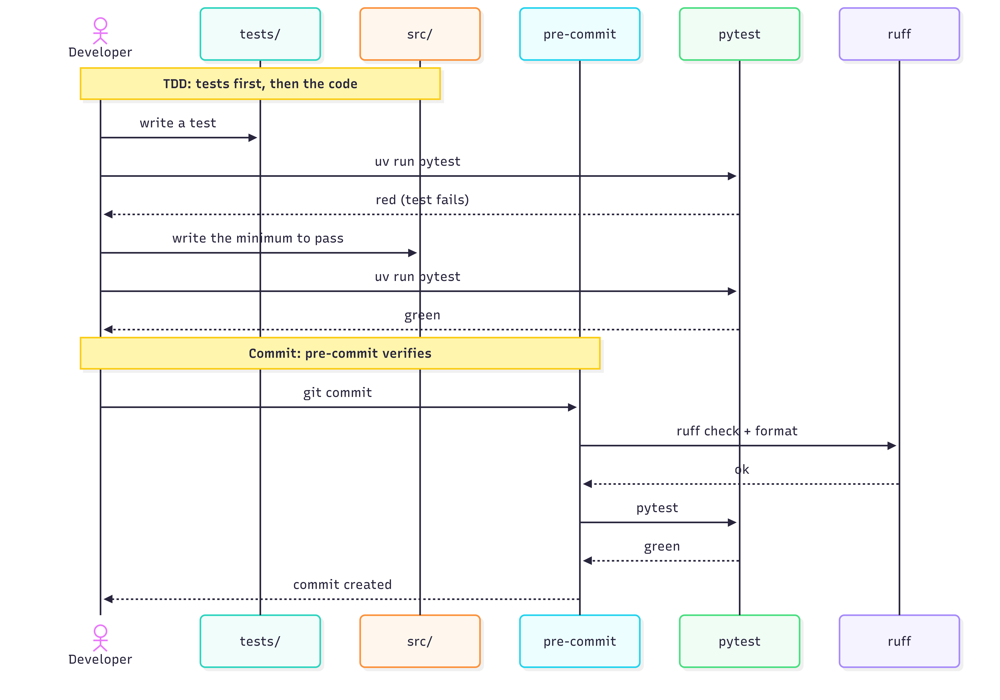

Code quality
============

This page describes the day-to-day code quality cycle of the project: how the four tools chosen during the refactoring (``uv``, ``ruff``, ``pyright``, ``pre-commit``) work together while you write code, until the commit is accepted.

Two views from two angles. The first one is a flowchart that shows the cycle from the perspective of the **tools**: who runs when, where each one fits, and what happens at the *all green ?* fork. The second one is a sequence diagram that shows the cycle from the perspective of **time**: tests are written first, then the code, and pre-commit verifies again at ``git commit``.

The cycle of the four tools
###########################

The flowchart below shows the daily cycle of the four tools. ``uv sync`` (dotted) is the initial setup, not part of the daily loop. While you write code, ``pyright`` runs in real time inside the IDE (typically via Pylance on VS Code). When you ``git commit``, the ``pre-commit`` hook fires ``ruff check + format`` and ``pytest``: if all green, the commit is accepted; if not, you fix and the loop starts again.

For the configuration of each tool see `howtomake / Test tools <https://simple-sample.readthedocs.io/en/latest/howtomake.html#test-tools>`_; for the story of why these tools were chosen see `refactoring <https://simple-sample.readthedocs.io/en/latest/refactoring.html>`_ (Step 6 to Step 10).

.. image:: ../images/code.quality.vertical.flowchart.png
   :alt: Code quality cycle with uv, pyright in IDE, ruff and pytest at pre-commit
   :align: center

The TDD sequence
################

The sequence diagram below shows the same cycle from a temporal angle, focused on TDD. The order matters: ``pytest`` works only if the tests exist, and tests are written before the code. The first part of the sequence (``Dev``, ``tests/``, ``src/``, ``pytest``) is the TDD loop in local: write a test, see it red, write the code, see it green. The second part (``Dev``, ``pre-commit``, ``ruff``, ``pytest``) is the verification at ``git commit``: pre-commit runs the same tools again as a safety net before the commit is accepted.

For examples of pytest tests in this repo see `howtouse / PyTest <https://simple-sample.readthedocs.io/en/latest/howtouse.html#pytest>`_; for the conversion of unit tests from ``unittest`` to ``pytest`` see Step 5 of the `refactoring <https://simple-sample.readthedocs.io/en/latest/refactoring.html>`_ page.

